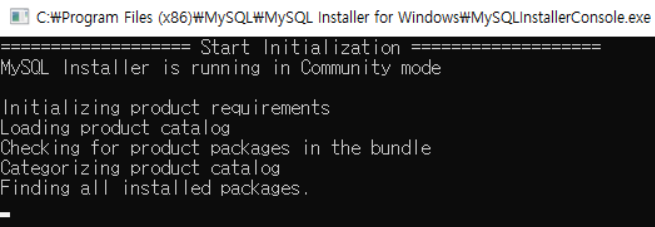

# MySQL
## 24:00마다 MySQLInstallerConsole.exe 자동 실행
---
### 증상
24:00마다 MySQLInstallerConsole.exe가 자동으로 실행됨

### 원인  
- 카탈로그 자동 업데이트

### 해결
- 스케줄을 변경
    - 제어판 > 시스템 및 보안 > 관리도구 > 작업 스케줄러
    - 작업 스케줄러 라이브러리 > MySQL > Installer
    ManefestUpdate 스케줄 우클릭 > 사용 안함
        - 또는 시간대를 변경
    - 또 다른 방법 최초 MySQL Installer 실행시 나오는 **렌치모양 버튼**을 누르면 카탈로그 업데이트에 관해 설정이 가능
---
---

# Eclipse
## jdk 환경변수를 찾을 수 없음
---
### 원인
1. jdk 경로를 default(C:\ProgramFiles\java\jdk-versionNum)가 아닌 임의로 변경 시 이클립스가 자동으로 찾을 수 없음
2. import 할때 jdk 버전이 맞지 않는 경우

### 해결
1. 환경변수에 jdk 위치를 등록
2. jdk 버전 매치
    - project explorer 우클릭 > Build Path > ConfigureBuild Path
    - Java Compiler에서 JDK 버전 수정

---
---