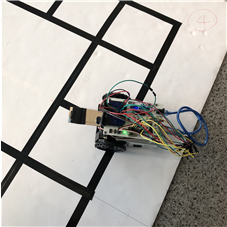

# 기초공학설계 기말과제: LineTracer
## 요약
아두이노를 활용해 검은 선을 탐지하고 이동하는 로봇 `LineTracer`를 만들고 주어진 랜덤한 문제를 해결하는 프로그램을 개발하는 과제이다. 문제는 랜덤한(3가지) 격자미로에 3개의 장애물 중 1개는 골인지점에 넣고 나머지 2개는 밖으로 밀어내는 것이 목표이다.

## 나의 역할
문제를 정의하고 전체 시나리오에 대한 알고리즘을 만들었다. 팀원들에게 시나리오를 설명하고 Bottom-up 방식으로 문제를 해결하도록 했다. 로봇의 움직임이 어디까지 가능한지 먼저 알아야 알고리즘에 맞는 프로그래밍이 가능하기 때문이다.

### 내가 설계한 기능
- 기본 움직임과 탐지
    - 전진, 멈춤, 좌회전, 우회전
    - 수직 수평을 맞추기 위한 미세회전
    - 교차로 탐지, 외곽 탐지, 골인지점 탐지
- 알고리즘 설계
    1. 골인지점 찾기
    2. 장애물 1개 골인지점으로 집어넣기
    3. 나머지 장애물 2개 외곽으로 밀어내기

## 결과물

 