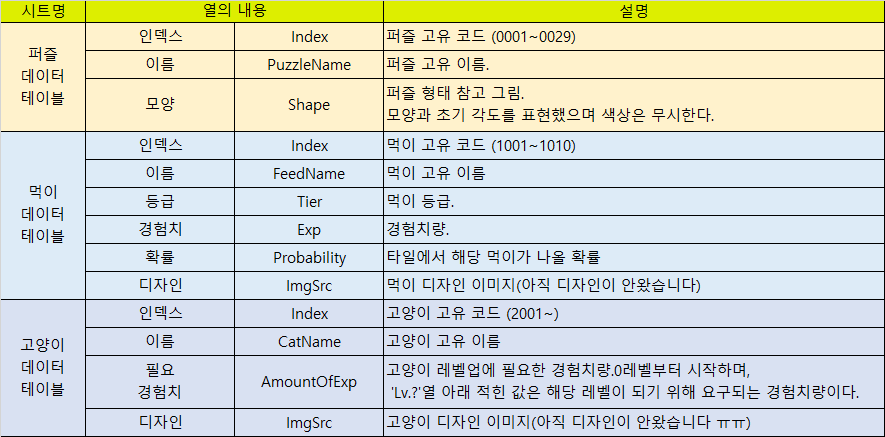
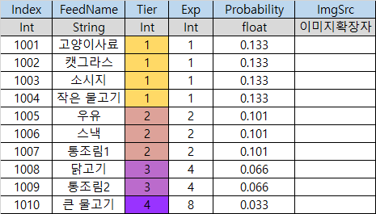

# 고양이 퍼즐 데이터테이블
## 설명
- 2021년 8월부터 참여한 고양이 퍼즐 게임 개발 프로젝트에서 작성한 데이터테이블이다.
- 퍼즐조각을 빈 보드판에 끼워넣어 맞추면 보상으로 먹이를 얻을 수 있다.
- 먹이를 고양이에게 먹이면 고양이가 레벨업을 한다.

## 항목 설명 테이블

 - 각 데이터테이블에 필드명과 의미를 설명하는 테이블이다.

## 퍼즐 데이터테이블

## 먹이 데이터테이블

## 고양이 데이터테이블

