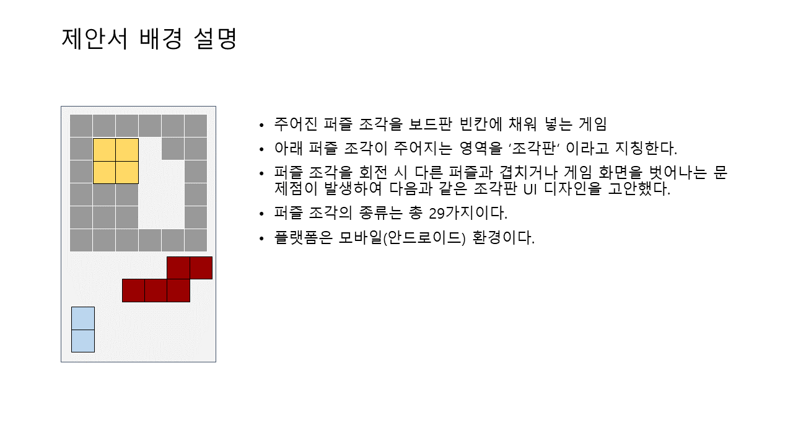
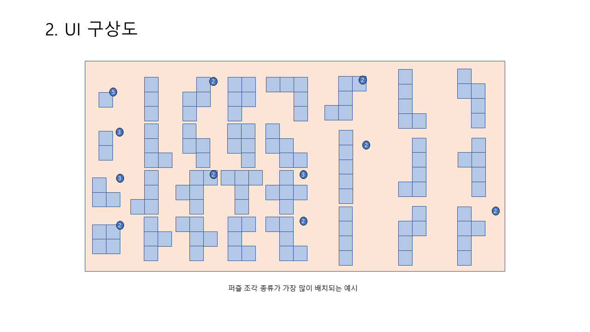
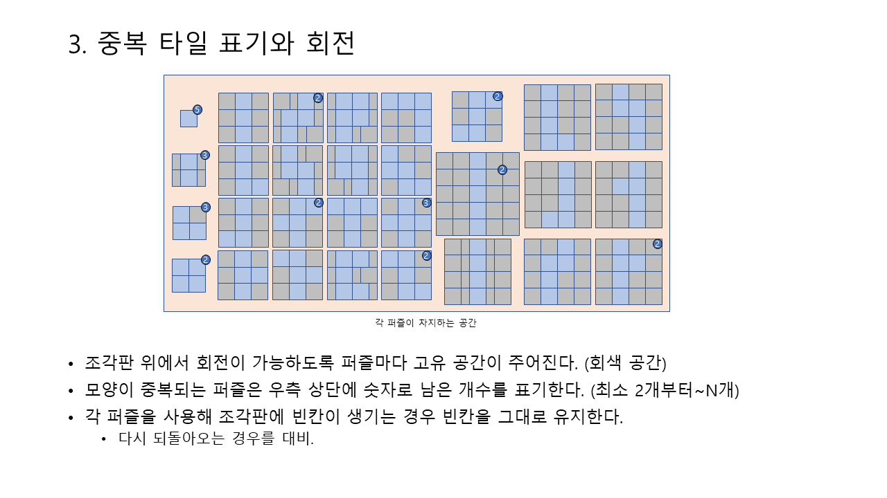
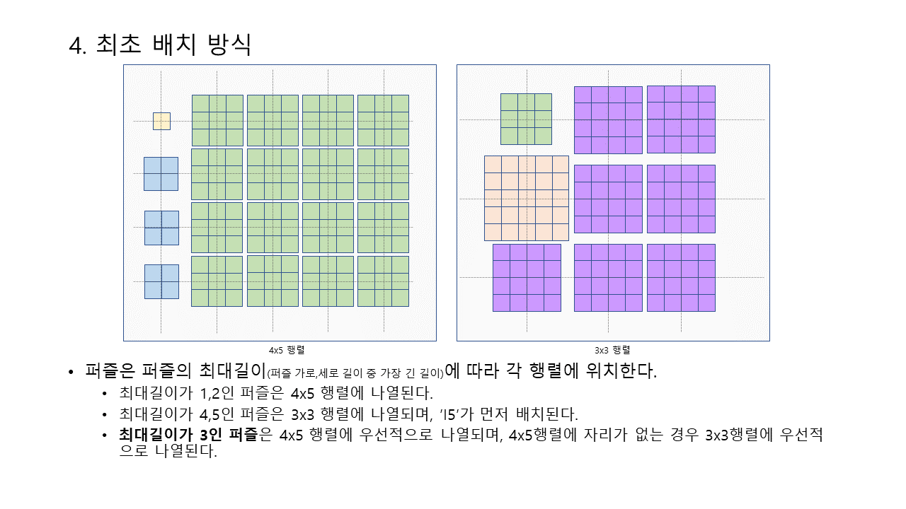
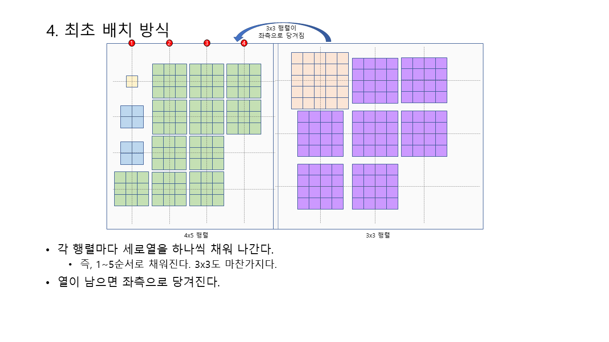
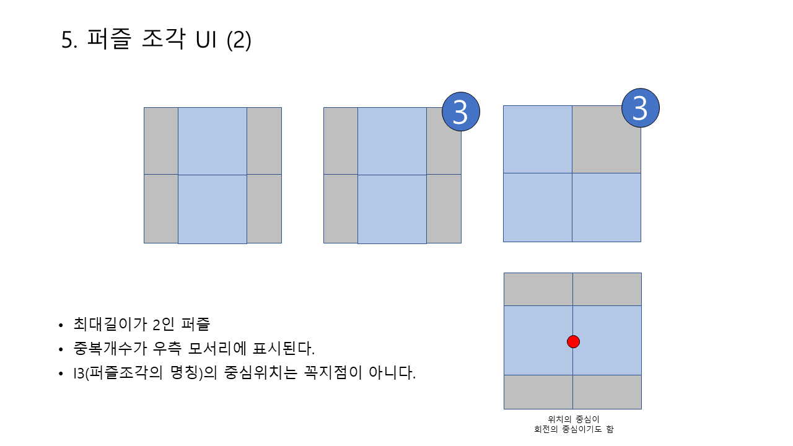
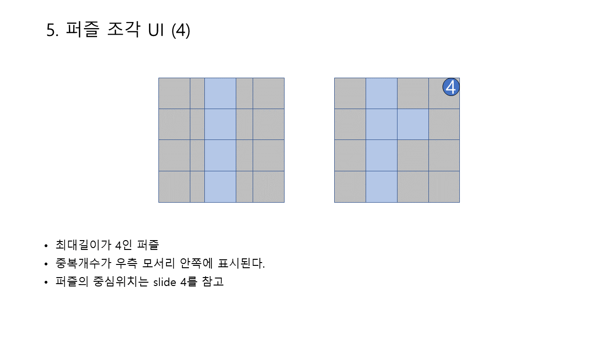

# 고양이 퍼즐 조각판 제안서
## 개요
- 2021년 8월부터 참여한 고양이 퍼즐 게임 개발 프로젝트에서 작성한 데이터테이블이다.
- `조각판`이란 맞춰지지 않은 퍼즐 조각이 나열되어 있는 판을 의미한다.
- 크기가 제각각인 퍼즐 조각을 `조각판` 위에 정렬하는 방법을 제시했다.

## 제안서 요약
### 요구기능
- 해당 스테이지에 필요한 퍼즐조각이 모두 담겨야 한다.
- 퍼즐 조각이 조각판 위에서 회전하더라도 다른 타일을 침범하지 않는다.
- 조각은 스테이지마다 최대 29개까지 사용된다.
- 모든 퍼즐조각이 한 화면에 들어오도록 한다.
- 조각판 안 퍼즐조각끼리 크기를 비교했을 때 왜곡이 없도록 한다.

### 디자인

### 상세 설명

- [제안서전문](img)